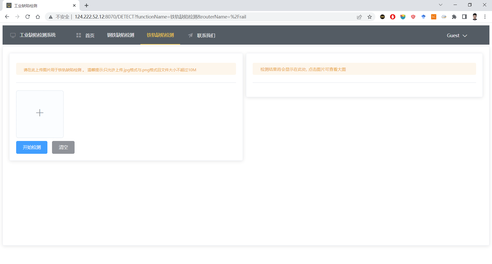

# CCNet Document
[中文文档](README_zh.md)

## About Model

The model backbone is CSP-Darknet, the feature extraction network is PANet, and the detection head network is Decoupled head.

**We provide the following network structures**

1. `net.py` include SPPF, SpaceToDepth, MobileViT
2. `net_old.py` include SPPF, MobileViT
3. `net_deploy.py` include SPPF, FocusReplaceConv

**What improvements have we made to the overall network?**

1. We replaced the SPP of layer5 of CSP-Darknet with SPPF, and added MobileViT after SPPF (Our implementation based on Apple's paper: [《MobileViT: Light-weight, General-purpose, and Mobile-friendly Vision Transformer》](https://arxiv.org/abs/2110.02178))
2. In the backbone network, we set a (1: 1: 3: 1) ratio for Bottleneck in the last 4 CSPLayer, references: [《A ConvNet for the 2020s》](https://openaccess.thecvf.com/content/CVPR2022/papers/Liu_A_ConvNet_for_the_2020s_CVPR_2022_paper.pdf)
3. We added a three-layer CBAM attention mechanism between the backbone network and the feature extraction network
4. We adjusted the downsample structure of the overall network and used a new downsampling method to reduce the loss of granularity, references: [No More Strided Convolutions or Pooling: A New CNN Building Block for Low-Resolution Images and Small Objects](https://arxiv.org/abs/2208.03641)


## Coming Soon

- [x] Enhance the recognition of small target objects
- [ ] Add COCO format training files
- [ ] Development of the TensorRT version
- [x] Add AMFF-YOLOX structure


## How to Train and Evaluate

1. Put the dataset into datasets and create a new folder for it (all paths do not use Chinese), you need to use VOC format (JPEGImages, Annotations)
2. About generating datasets, modify `voc_classes`, `file_dir` in `tools/annotations.py`, right-click to run
3. Regarding training, modify the parameters in `if __name__ == "__main__"` in `tools/train.py`, right-click to run the training
4. For training datasets, enter `tensorboard --logdir=results` in the console, open the browser, enter `localhost:6006` to view;
5. About evaluation, modify the parameters in `if __name__ == "__main__"` in `tools/eval.py`, right-click to run the evaluation


## Pre-deployment

1. We assume that the user is using Linux and has already installed Anaconda, Miniconda, or similar virtual environment. Therefore, we will not go into further details here. If you need assistance, please consult a search engine or ChatGPT.

2. Create a new environment for your virtual environment or use the base environment. In the project directory, locate the `auto_install_package.sh` file and use the following command to install the required packages for this project:

   ```bash
   sh auto_install_package.sh
   ```

3. Set the working environment to open by default. Taking Miniconda as an example, use the following command to open the `.bashrc` file:

   ```bash
   sudo vim ~/.bashrc
   ```

   Add the following statement at the end of the file:

   ```bash
   conda activate XXX(你的Pytorch环境)
   ```

   Save the file and execute the following command to complete the configuration:

   ```bash
   source ~/.bashrc
   ```


## How to Communicate with Servers such as Springboot


1. In the `tools/socket2springboot.py` file, we use socket for communication. The default port for the project is `12345`.

2. The project provides an automatic deployment script file named `socket2springboot.sh`. Before using it, please modify the `project_path` in the script file. Run the script using the following command:

   ```bash
   sh socket2springboot.sh
   ```

3. Alternatively, you can deploy manually by running the following command in the current working environment. This command runs the script in the background:

   ```bash
   nohup python tools/socket2springboot.py
   ```

   You can also run the Python script in the background and save the output log to a specified file using the following command:

   ```bash
   nohup python -u tools/socket2springboot.py > /your/path/log/logname.log 2>&1 &
   ```

   To restart or stop the service, use the `htop` command to find the running program and `kill` it, or use the kill command:

   ```bash
   kill $(ps -ef | grep "socket2springboot.py" | grep -v grep | awk "{print $2}")
   ```

4. When testing if the program is running successfully, use the following command to check the PID of the current running program:

   ```bash
   ps -def | grep "socket2springboot.py"
   ```

   Once it is found, run `method_test.py` to send a test JSON data stream:

   ```bash
   python test/method_test.py
   ```

5. The data transmission is done in JSON format. The format of the data sent from the client to the server is as follows:

   ```json
   {
       "model_name": "Net", 
       "model_path": "/your/modle/path/your_model_name.pth",
       "dataset": "NEUDET",
       "input_shape": [224, 224],
       "conf_thres": 0.5,
       "nms_thres": 0.6,
       "image_path": ["/your/image/path/image1.jpg",
                      "/your/image/path/image2.jpg",
                      "/your/image/path/image3.jpg"]
   }
   ```
6. After sending the data, use the following command to open the log file. The file will record the JSON data stream returned by the server:

   ```bash
   vim log/socket2springboot_timestamp.log
   ```

7. The data stream returned from the server to the client is in the following format:

   ```json
   {
       "image": [
           {"image_path": "/your/image/path/image1.jpg", "image_id": 0}, 
           {"image_path": "/your/image/path/image2.jpg", "image_id": 1}, 
           {"image_path": "/your/image/path/image3.jpg", "image_id": 2}], 
       "annotations": [
           {"image_id": 0, "box": [117.38097, 32.385307, 133.57707, 62.68074], "predicted_class": "class1", "conf": 0.66143817}, 
           {"image_id": 0, "box": [33.51411, 6.4222217, 48.198418, 34.87923], "predicted_class": "class1", "conf": 0.64585626}, 
           {"image_id": 0, "box": [112.736916, 146.3184, 133.77809, 198.33405], "predicted_class": "class1", "conf": 0.63799584}, 
           {"image_id": 0, "box": [114.86066, 73.44805, 142.24493, 114.508995], "predicted_class": "class1", "conf": 0.61806077}, 
           {"image_id": 1, "box": [108.89356, -5.1439524, 180.93867, 138.25955], "predicted_class": "class2", "conf": 0.7961505}, 
           {"image_id": 1, "box": [92.11259, 127.67179, 183.05533, 199.58357], "predicted_class": "class2", "conf": 0.7741741}, 
           {"image_id": 1, "box": [10.045683, 65.02976, 73.03552, 122.30415], "predicted_class": "class2", "conf": 0.72269356}, 
           {"image_id": 2, "box": [32.543327, 38.372814, 145.7598, 195.50223], "predicted_class": "class3", "conf": 0.7584684}]
   }
   
   ```
   
## Project Display

Web author @[lizhaoguo123](https://github.com/lizhaoguo123)

**Detection page**




**Admin page**


